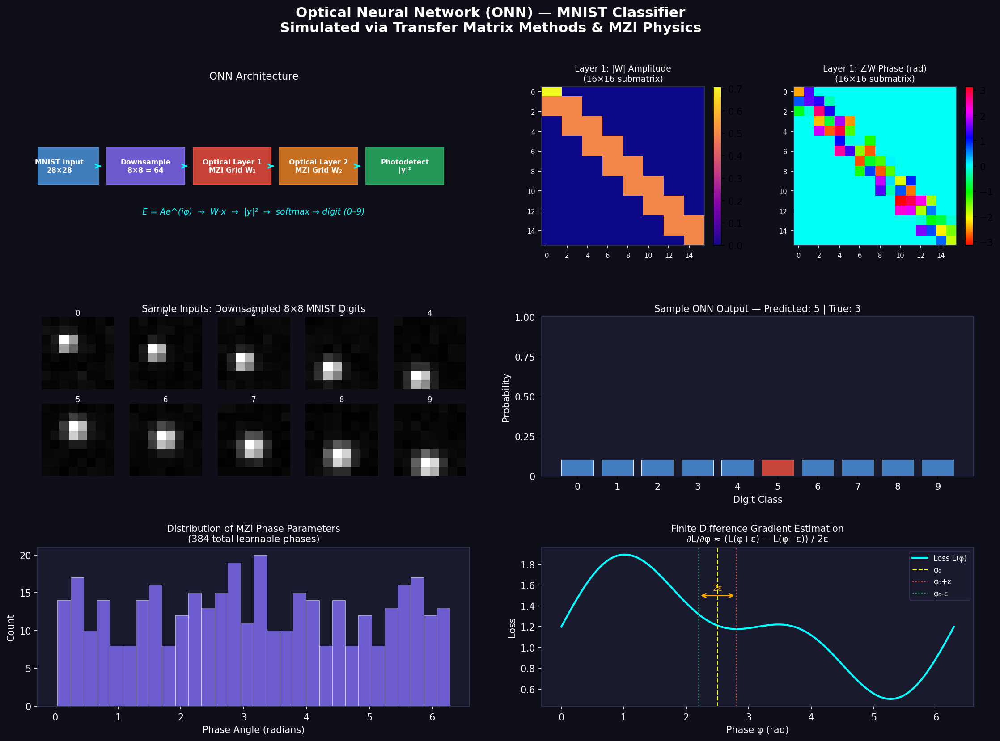

# Optical Neural Network (ONN) for MNIST Classification

> A NumPy simulation of a photonic neural network using **Transfer Matrix Methods** and **Mach-Zehnder Interferometers (MZIs)** — tested on the MNIST handwritten digit dataset.



---

## Why This Project

A NumPy simulation of a photonic neural network using Transfer Matrix Methods and Mach-Zehnder Interferometers (MZIs) tested on the MNIST handwritten digit dataset.

Traditional neural networks perform matrix multiplications using **electronic circuits**.  
An **Optical Neural Network** does the same computation using **light** — potentially orders of magnitude faster and more energy-efficient.

This project simulates that physics entirely in software using NumPy.

---

##  How It Works

```
MNIST Image (28×28)
        ↓
Downsample to 8×8 = 64 pixels
        ↓
Encode as complex optical field:  E = A·e^(iφ)
        ↓
Optical Layer 1  →  W₁x   (MZI transfer matrix multiply)
        ↓
Optical Layer 2  →  W₂(W₁x)
        ↓
Optical Layer 3  →  W₃(W₂(W₁x))
        ↓
Photodetection   →  |y|²  (intensity measurement)
        ↓
Softmax  →  predicted digit (0–9)
```

---

##  Physics Behind the Model

### Light Representation
Each waveguide channel carries a complex amplitude:
```
E = A · e^(iφ)      (A = amplitude,  φ = phase)
```

### MZI Transfer Matrix
The fundamental trainable unit — a Mach-Zehnder Interferometer:
```
T_MZI = PhaseShifter(φ₂) · BeamSplitter · PhaseShifter(φ₁)
```

Beamsplitter:
```
T_BS = (1/√2) · [[1, i], [i, 1]]
```

Phase shifter:
```
T_PS = [[e^(iφ), 0], [0, 1]]
```

### Training: Finite Difference Gradient Estimation

Physical ONNs **cannot use backpropagation** — you can only measure outputs, not intermediate gradients. We use **finite differences**, the same approach used on real photonic hardware:

```
∂L/∂φ  ≈  ( L(φ + ε) − L(φ − ε) ) / (2ε)
```

This is a zeroth-order optimization method — hardware-compatible and physically realistic.

---

##  Project Structure

```
onn-mnist/
├── README.md
├── requirements.txt
├── data/
│   └── mnist_loader.py       # Load + downsample MNIST to 8×8
├── onn/
│   ├── layers.py             # MZI, beamsplitter, phase shifter matrices
│   ├── network.py            # OpticalLayer and ONN model
│   └── utils.py              # Photodetection, softmax, loss functions
├── train.py                  # Training loop (finite difference optimizer)
└── evaluate.py               # Accuracy metrics + visualizations
```

---

##  Quickstart

```bash
# Clone
git clone https://github.com/sadiqmuhd/Optical-Neural-Network-ONN-for-MNIST-Classification.git
cd Optical-Neural-Network-ONN-for-MNIST-Classification

# Install dependencies
pip install -r requirements.txt

# Train
python train.py

# Evaluate + generate plots
python evaluate.py
```

---

##  Model Configuration

| Parameter | Value |
|---|---|
| Input size | 64 (8×8 downsampled MNIST) |
| Optical layers | 3 |
| MZI depth per layer | 2 columns |
| Trainable parameters | 384 phase angles |
| Optimizer | Finite difference gradient estimation |
| Dataset | MNIST — 3000 train / 500 test |

---

## 🔗 Connection to Real Photonic Hardware

| This Simulation | Real ONN Chip |
|---|---|
| NumPy complex matrices | Silicon photonic waveguides |
| MZI transfer matrices | Physical Mach-Zehnder Interferometers |
| Phase angle tuning | Thermo-optic / electro-optic phase control |
| Finite difference training | Hardware-compatible gradient-free optimization |
| Photodetection `\|y\|²` | On-chip germanium photodetectors |

---

## References

* **Shen et al. (2017)** — *Deep learning with coherent nanophotonic circuits* — Nature Photonics. (Foundational MZI architecture).
* **Wan, Y. et al. (2026)** — *Integrated quantum dot lasers for parallelized photonic edge computing* — Advanced Photonics. (Hardware validation for parallelized ONN inference).
* **Hughes et al. (2018)** — *Training of photonic neural networks through in situ backpropagation* — Optica. (Mathematical basis for physical training).
* **Wan et al. (2021)** — *Large-scale photonic integrated circuit based optical neural network* — Laser & Photonics Reviews.

---

##  Author

**Abubakar Sadiq Muhammad**  
Electrical & Electronics Engineering  
[github.com/sadiqmuhd](https://github.com/sadiqmuhd)
